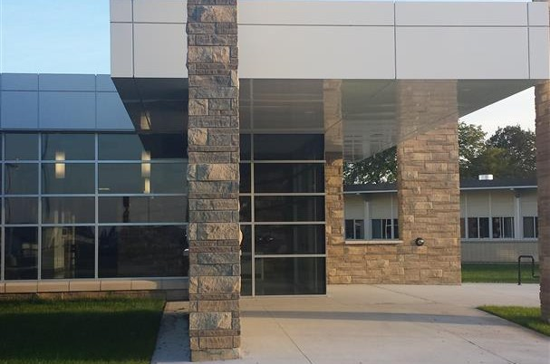

# ROA Studio Inc.
>First Redline Project
Start date: March 6th
Project Status: Finished unless client requests changes
This was an exercise given by BeCode with the task to recreate a website for an architect company.

>Installation:
>No Installation needed. This code was written on Sublime Text and are written in HTML and CSS. 
>There is a picture gallery on the first page that contains 8 images. It is an automatic set-time image gallery. You can't physically slide the images.

HTML Ex:
>This is just a simple image slider

		<figure>
			
			
			
			
			
			
			
			
		</figure>
	

  
  
CSS Ex:
nav a::before{
    content:'';
    display: block;
    height: 5px;
    width: 0%;
    background-color: #f77000; 
    position: absolute;
    top: 0;
    transition: all ease-in-out 250ms;
}
nav a:hover::before {
    width: 100%;
}
a:visited{
    color: #f77000;
}

>This is how I created the animation on the navigation bar using CSS.

No license, I am the only contributor.

URL where the website is published:
https://frannyaimee.github.io/ROAStudio/
